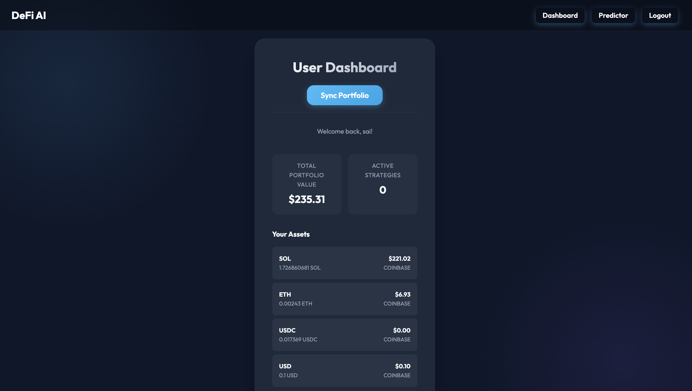

# DeFi AI Predictor & Portfolio Advisor

A comprehensive AI-driven cryptocurrency platform that combines advanced price prediction with real-time portfolio management. This application uses Deep Learning (LSTM) to forecast market trends and integrates directly with major exchanges like Coinbase and Binance to track your actual assets.



## 🚀 Features

*   **AI Price Prediction**: Uses a Long Short-Term Memory (LSTM) neural network to predict 30-day price trends for any cryptocurrency.
*   **Real-Time Market Data**: Fetches live price data, volume, and technical indicators (RSI, MACD, EMA).
*   **Portfolio Sync**: Securely connects to **Coinbase** and **Binance** via API to import and track your real-time balances.
*   **User System**: Secure Authentication (Login/Register) with JWT and encrypted API key storage.
*   **Interactive Dashboard**: Dark-mode UI with dynamic charts (Chart.js) and instant portfolio valuation.
*   **Privacy Focused**: All API keys are encrypted (AES-256) and stored locally in your SQLite database.

## 🛠️ Tech Stack

*   **Backend**: Node.js, Express.js
*   **AI Engine**: Python, TensorFlow/Keras, Pandas, TA-Lib
*   **Database**: SQLite (Local)
*   **Frontend**: HTML5, CSS3 (Glassmorphism), JavaScript, Chart.js
*   **Integration**: CCXT (Crypto Exchange Trading Library)

## 📦 Installation

### Prerequisites
*   Node.js (v16+)
*   Python (v3.8+)

### 1. Clone the Repository
```bash
git clone https://github.com/yourusername/defi-ai-project.git
cd defi-ai-project
```

### 2. Install Backend Dependencies
```bash
npm install
```

### 3. Setup Python Environment
It's recommended to use a virtual environment.
```bash
python3 -m venv new_venv
source new_venv/bin/activate  # On Windows: new_venv\Scripts\activate
pip install -r requirements.txt
```
*(Note: If `requirements.txt` is missing, install: `pandas numpy tensorflow scikit-learn pandas_ta ccxt`)*

### 4. Initialize Database
The database (`database.sqlite`) will be automatically created when you start the server for the first time.

## 🚀 Usage

1.  **Start the Server**:
    ```bash
    node index.js
    ```
2.  **Open the App**:
    Go to [http://localhost:3000](http://localhost:3000) in your browser.

3.  **Create an Account**:
    Click "Login" -> "Register" to create your local account.

4.  **Connect Exchange** (Optional):
    -   Go to your Dashboard.
    -   Click "Connect Exchange".
    -   Enter your **Read-Only** API Key and Secret from Coinbase/Binance.
    -   *Note: For Coinbase Advanced Trade, use the full EC Private Key.*

5.  **Predict Prices**:
    -   Go to the "Predictor" tab.
    -   Enter a symbol (e.g., `BTC`, `ETH`, `SOL`).
    -   Click "Analyze Market & Predict".

## ⚠️ Disclaimer
This software is for educational purposes only. **Do not use it as financial advice.** Cryptocurrency trading involves significant risk.

## 📄 License
MIT
